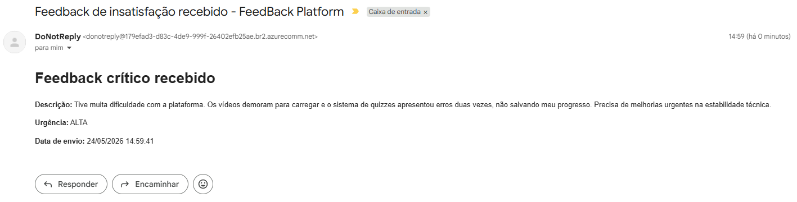

# Tech Challenge FIAP Fase 4

## Projeto

**Tech Challenge FIAP — Fase 4**  
**Curso:** Pós-Graduação em Arquitetura e Desenvolvimento em Java  
**Serviços:** `az-func-feedback-login`, `az-func-feedback-core` e `az-func-feedback-report`     
**Tema:** Plataforma serverless para recebimento, classificação, persistência e notificação de feedbacks educacionais.

## Equipe

| Nome | RM | E-mail |
|---|---:|---|
| Alexandre Belisário Duarte Leite de Andrade | RM367163 | alexbdla@gmail.com |
| Kervin Sama Candido da Silva | RM367345 | kervincandido@gmail.com |

## Links do projeto

| Item | Link |
|---|---|
| **[az-infra-feedback](https://github.com/KervinCandido/az-infra-feedback)** | https://github.com/KervinCandido/az-infra-feedback |
| **[az-func-feedback-login](https://github.com/KervinCandido/az-func-feedback-login)** | https://github.com/KervinCandido/az-func-feedback-login |
| **[az-func-feedback-core](https://github.com/KervinCandido/az-func-feedback-core)** | https://github.com/KervinCandido/az-func-feedback-core |
| **[az-func-feedback-report](https://github.com/KervinCandido/az-func-feedback-report)** | https://github.com/KervinCandido/az-func-feedback-report |
| **[Vídeo de apresentação](https://www.youtube.com/)** | https://www.youtube.com/ **(Pendente)**| 
| **[Collection Postman](https://github.com/KervinCandido/az-infra-feedback/blob/main/collections/Feedback%20Platform.postman_collection.json)** | https://github.com/KervinCandido/az-infra-feedback/blob/main/collections/Feedback%20Platform.postman_collection.json |

## Arquitetura da Solução

A solução adota uma arquitetura orientada a microsserviços serverless, baseada nativamente nos recursos da **Microsoft Azure**. O objetivo é garantir segurança, escalabilidade automática e baixo custo por meio do consumo sob demanda.


### Microsserviços (Azure Functions)
Toda a lógica de negócios e APIs operam no formato Serverless através de Functions, separadas por domínios:

- **az-func-feedback-login**:
  Responsável pelo módulo de autenticação e autorização. Realiza a emissão de tokens JWT e verificação de identidades utilizando chaves RSA assimétricas.
- **az-func-feedback-core**:
  Microsserviço principal onde residem as regras de negócio de captura e processamento dos feedbacks. Integra-se ao banco de dados (PostgreSQL) e envia notificações (Azure Communication Services).
- **az-func-feedback-report**:
  Microsserviço assíncrono para geração e processamento de relatórios, persistindo os resultados em blobs (Azure Storage Account) e enviando o relatório para os administradores por e-mail via Azure Communication Services.

### Infraestrutura e IaC
A automação da infraestrutura cloud foi realizada utilizando repositório `az-infra-feedback`, que apresenta os diagramas e a automação para construção do ambiente cloud.

Os recursos provisionados de nuvem incluem:
- **Rede e Segurança**: Virtual Network (VNet) com Subnets privadas isolando o banco de dados.
- **Key Vault**: Gerenciamento seguro e centralizado de segredos (Senhas, Strings de Conexão e Chaves JWT).
- **Banco de Dados**: Azure Database for PostgreSQL (Flexible Server).
- **Armazenamento**: Azure Storage Account.
- **Notificações**: Azure Communication Services e Azure Email Services para envio de alertas.
- **Monitoramento**: Azure Log Analytics Workspace e Application Insights atrelados às Functions para observabilidade completa.
- **Computação**: Azure Functions (Planos de consumo para otimização de custos).

## Deploy Automatizado (CI/CD)

Toda a solução utiliza **GitHub Actions** em conjunto com **Azure AD Federated Credentials (OIDC)**. Isso proporciona:
1. Deploys contínuos a cada mudança na branch `main`.
2. Nenhuma credencial persistida no GitHub; os runners assumem uma identidade provisória de forma segura.
3. Todas as credenciais de banco, storage e chaves JWT residem exclusivamente no **Azure Key Vault**.

### Motivação do uso de CI/CD
Com o uso dessa solução, sempre que um integrante da equipe altera o repositório e envia as atualizações para a branch main, um processo de CI/CD é iniciado automaticamente. Isso realiza o build e o deploy dos serviços sem a necessidade de intervenção manual, garantindo que as alterações cheguem à produção de forma rápida e segura.

## Arquitetura do Sistema

A arquitetura do sistema foi projetada para seguir os princípios de microsserviços, utilizando recursos nativos da Azure para garantir escalabilidade, segurança e baixo custo.

Os microsserviços do sistema são todos *serverless*, ou seja, executam sob demanda e escalam automaticamente conforme a necessidade. Entre eles, o `az-func-feedback-login` e o `az-func-feedback-core` funcionam via *HTTP trigger*, enquanto o `az-func-feedback-report` atua por *timer trigger*, executando periodicamente para gerar relatórios e enviá-los por e-mail para os administradores.

### Login - `az-func-feedback-login`

Este microsserviço é responsável pelo gerenciamento de autenticação e autorização. Ele foi projetado para ser apenas um demonstrativo de como funcionaria um microsserviço com esse propósito; por isso, foi desenvolvido para utilizar um banco de dados em memória (utilizando o banco de dados `H2` em modo de compatibilidade com PostgreSQL) contendo apenas usuários e senhas de demonstração. Sua única função é gerar um token JWT assinado para ser utilizado pelos demais microsserviços — neste caso, especificamente pelo `az-func-feedback-core`, responsável pela lógica de negócio do sistema.

O componente utiliza um único recurso da Azure: o Azure Key Vault, empregado para obter as chaves necessárias para a assinatura e a geração dos tokens JWT. 

Este microsserviço possui um único *endpoint* HTTP, denominado `/api/sign-in`, que recebe as credenciais de usuário e senha e retorna um token JWT assinado.

**Exemplo de *payload* de requisição:**
```json
{
    "username": "<username>",
    "password": "<password>"
}
```

**Exemplo de resposta (response):**
```json
{
    "type": "Bearer",
    "token": "<jwt-token>",
    "issuedAt": <timestamp>,
    "expiresAt": <timestamp>
}
```

Os usuários e senhas de demonstração estão disponíveis nas variáveis de ambiente do microsserviço, são:

| Usuário | Senha | Papel |
|---|---|---|
|`aluno`|`senha123`|`ALUNO`|
|`admin`|`senha123`|`ADMIN`|
|`professor`|`senha123`|`PROFESSOR`|


### Core - `az-func-feedback-core`

Este microsserviço é responsável pelo processamento de *feedbacks* e pela lógica de negócio da plataforma. Ele recebe as avaliações dos usuários, processa-as e as armazena no Azure Database for PostgreSQL. Além disso, o componente envia notificações por e-mail para os administradores por meio do Azure Email Communication Services caso um *feedback* seja classificado com o nível de urgência "ALTA". Essa classificação ocorre em casos de notas menores ou iguais a 3 ou quando o texto contém palavras-chave como "travando", "bug", "não funciona", entre outras.

Além dos componentes da Azure já citados anteriormente, o *core* também utiliza o Azure Key Vault para obter as chaves necessárias para o seu funcionamento. Entre as credenciais armazenadas, encontram-se a URL, o usuário e a senha do banco de dados, a chave de conexão com o Azure Email Communication Services e a chave pública necessária para validar o token JWT do usuário.

O *core* disponibiliza o *endpoint* HTTP `/api/avaliacoes` utilizando o método POST, sendo este responsável pelo recebimento dos *feedbacks*.

**Exemplo de *payload* de requisição:**
```json
{
    "descricao": "<feedback>",
    "nota": <nota> (de 0 a 10)
}
```

**Exemplo de resposta (response):**
```json
{
    "id": "<uuid>",
    "descricao": "<feedback>",
    "nota": <nota> (de 0 a 10),
    "urgencia": "<ALTA|MEDIA|BAIXA>",
    "dataCriacao": "<timestamp>"
}
```
**Exemplo de email de notificação (urgência ALTA):**


### Report - `az-func-feedback-report`

O *report* é um microsserviço *serverless* responsável pela geração de relatórios semanais de *feedbacks*. Este microsserviço é acionado por meio de um *timer trigger* configurado para executar uma vez por semana, sempre à meia-noite de sábado. O componente extrai os dados conectando-se ao Azure Database for PostgreSQL, gera os relatórios de *feedbacks*, armazena-os em um *container de blob* (Azure Storage Account) e os envia para os administradores por e-mail por meio do Azure Email Communication Services, facilitando o acesso às informações consolidadas.

Além disso, o microsserviço utiliza o Azure Key Vault para obter as chaves necessárias para o seu funcionamento. Entre as credenciais armazenadas, encontram-se a URL, o usuário e a senha do banco de dados, a chave de conexão com o Azure Storage Account e a credencial de acesso ao Azure Email Communication Services.

O fluxo da função é:

```text
TimerTrigger
    ↓
func-feedback-report
    ↓
Consulta feedbacks da última semana no banco de dados
    ↓
Calcula total, média, quantidade por dia e quantidade por urgência
    ↓
Serializa o relatório em JSON
    ↓
Armazena o arquivo no Azure Blob Storage E Envia o relatório por e-mail para os administradores (assincronamente)
```

O nome do arquivo gerado segue o padrão:

```text
reports/weekly/{ano}/{mes}/{inicio}-{fim}-relatorio-semanal-feedbacks.json
```
Sendo inicio e fim o intervalo de data do relatório no formato: AnoMesDia (no fuso horario America/Sao_Paulo).

O relatório é gerado no dia que o timer for acionado e considera o período entre o início do dia atual no fuso horarioAmerica/Sao_Paulo e uma semana antes.

```text
Exemplo:
O relatório é gerado no dia 23/05/2026 00:00:00 (-03:00)
O relatório considera o período entre 18/05/2026 23:59:00 (-03:00) e 23/05/2026 00:00:00 (-03:00)
O nome do arquivo gerado será: reports/weekly/2026/05/20260518-20260523-relatorio-semanal-feedbacks.json
```

**Exemplo de conteúdo de relatório:**
```json
{
  "inicio" : "2026-05-13T00:00:00-03:00",
  "fim" : "2026-05-20T23:59:59.999999999-03:00",
  "totalAvaliacoes" : 21,
  "mediaAvaliacoes" : 7.761904761904762,
  "quantidadePorDia" : {
    "2026-05-20" : 21
  },
  "quantidadePorUrgencia" : {
    "BAIXA" : 19,
    "MEDIA" : 1,
    "ALTA" : 1
  },
  "feedbacks" : [ 
    {
        "id" : "70282458-06bd-4b43-8f25-21cbb69da717",
        "descricao" : "Excelente abordagem para quem busca recolocação no mercado. Os projetos práticos apresentados no curso servem perfeitamente para compor um portfólio profissional. Recomendo fortemente para quem deseja se especializar!",
        "nota" : 8,
        "urgencia" : "BAIXA",
        "dataEnvio" : "2026-05-20T06:47:34.081258Z"
    }, {
        "id" : "ba46a1fd-583d-44aa-96ee-fda2912b0021",
        "descricao" : "Excelente abordagem para quem busca recolocação no mercado. Os projetos práticos apresentados no curso servem perfeitamente para compor um portfólio profissional. Recomendo fortemente para quem deseja se especializar!",
        "nota" : 8,
        "urgencia" : "BAIXA",
        "dataEnvio" : "2026-05-20T06:47:39.193396Z"
    } /* Outros feedbacks */
  ]
}
```

### Infra - `az-infra-feedback`

O repositório `az-infra-feedback` não é um microserviço como os outros. Trata-se de uma infraestrutura como código (IaC) responsável pela criação e gerenciamento dos recursos da Azure necessários para o funcionamento do sistema.


### Provisionamento da infraestrutura

A infraestrutura pode ser provisionada automaticamente pelo script `create-infra.sh` disponibilidado no [https://github.com/KervinCandido/az-infra-feedback/blob/main/scripts/](https://github.com/KervinCandido/az-infra-feedback/blob/main/scripts/).

Baixe os arquivos `.env.example` e `create-infra.sh` e coloque os dois na mesma pasta.

Então gere uma cópia do arquivo de exemplo `.env.example` e nomeie como `.env`
```bash
cp .env.example .env
```

Edite o `.env` com os nomes desejados para o ambiente e execute:

```bash
bash -n create-infra.sh
bash create-infra.sh
```

Por padrão, o script:

- carrega variáveis do `.env`, quando existir;
- registra automaticamente os providers necessários;
- cria os recursos de infraestrutura;
- configura Key Vault, Function Apps, RBAC, OIDC e tenta configurar os GitHub Secrets;
- não dispara a Function de relatório automaticamente;
- não remove arquivos temporários automaticamente.

> **Atenção:** o script configura os secrets do GitHub Actions nos repositórios definidos em `LOGIN_REPO`, `CORE_REPO` e `REPORT_REPO`.
> Em testes com ambientes alternativos, confira se esses repositórios estão corretos para evitar sobrescrever secrets dos repositórios oficiais.

> **Observação:** o script foi pensado para provisionar um ambiente novo. Para reexecuções, prefira usar nomes novos ou um Resource Group novo, pois alguns recursos da Azure podem não aceitar recriação/alteração quando já estão vinculados a outros serviços.

Para disparar a Function de relatório ao final da execução, defina no `.env`:

```bash
RUN_REPORT_TRIGGER="true"
```

Para remover os arquivos temporários ao final da execução, defina no `.env`:

```bash
RUN_CLEANUP="true"
```
