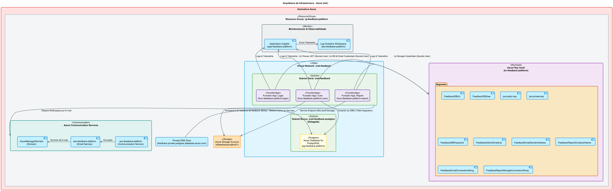

# Tech Challenge FIAP Fase 4

## Projeto

**Tech Challenge FIAP — Fase 4**  
**Curso:** Pós-Graduação em Arquitetura e Desenvolvimento em Java  
**Serviços:** `az-func-feedback-login`, `az-func-feedback-core` e `az-func-feedback-report`     
**Tema:** Plataforma serverless para recebimento, classificação, persistência e notificação de feedbacks educacionais.

## Equipe

| Nome | RM | E-mail |
|---|---:|---|
| Alexandre Belisário Duarte Leite de Andrade | RM367163 | alexbdla@gmail.com |
| Kervin Sama Candido da Silva | RM367345 | kervincandido@gmail.com |

## Links do projeto

| Item | Link |
|---|---|
| **[az-infra-feedback](https://github.com/KervinCandido/az-infra-feedback)** | https://github.com/KervinCandido/az-infra-feedback |
| **[az-func-feedback-login](https://github.com/KervinCandido/az-func-feedback-login)** | https://github.com/KervinCandido/az-func-feedback-login |
| **[az-func-feedback-core](https://github.com/KervinCandido/az-func-feedback-core)** | https://github.com/KervinCandido/az-func-feedback-core |
| **[az-func-feedback-report](https://github.com/KervinCandido/az-func-feedback-report)** | https://github.com/KervinCandido/az-func-feedback-report |
| **[Vídeo de apresentação](https://www.youtube.com/)** | https://www.youtube.com/ **(Pendente)**| 
| **[Collection Postman](https://github.com/KervinCandido/az-infra-feedback/blob/main/collections/Feedback%20Platform.postman_collection.json)** | https://github.com/KervinCandido/az-infra-feedback/blob/main/collections/Feedback%20Platform.postman_collection.json |

## Arquitetura da Solução

A solução adota uma arquitetura orientada a microsserviços serverless, baseada nativamente nos recursos da **Microsoft Azure**. O objetivo é garantir segurança, escalabilidade automática e baixo custo por meio do consumo sob demanda.



### Microsserviços (Azure Functions)
Toda a lógica de negócios e APIs operam no formato Serverless através de Functions, separadas por domínios:

- **az-func-feedback-login**:
  Responsável pelo módulo de autenticação e autorização. Realiza a emissão de tokens JWT e verificação de identidades utilizando chaves RSA assimétricas.
- **az-func-feedback-core**:
  Microsserviço principal onde residem as regras de negócio de captura e processamento dos feedbacks. Integra-se ao banco de dados (PostgreSQL) e envia notificações (Azure Communication Services).
- **az-func-feedback-report**:
  Microsserviço assíncrono para geração e processamento de relatórios, persistindo os resultados em blobs (Azure Storage Account) e enviando o relatório para os administradores por e-mail via Azure Communication Services.

### Infraestrutura e IaC
A automação da infraestrutura cloud foi realizada utilizando repositório `az-infra-feedback`, que apresenta os diagramas e a automação para construção do ambiente cloud.

Os recursos provisionados de nuvem incluem:
- **Rede e Segurança**: Virtual Network (VNet) com Subnets privadas isolando o banco de dados.
- **Key Vault**: Gerenciamento seguro e centralizado de segredos (Senhas, Strings de Conexão e Chaves JWT).
- **Banco de Dados**: Azure Database for PostgreSQL (Flexible Server).
- **Armazenamento**: Azure Storage Account.
- **Notificações**: Azure Communication Services e Azure Email Services para envio de alertas.
- **Monitoramento**: Azure Log Analytics Workspace e Application Insights atrelados às Functions para observabilidade completa.
- **Computação**: Azure Functions (Planos de consumo para otimização de custos).

## Deploy Automatizado (CI/CD)

Toda a solução utiliza **GitHub Actions** em conjunto com **Azure AD Federated Credentials (OIDC)**. Isso proporciona:
1. Deploys contínuos a cada mudança na branch `main`.
2. Nenhuma credencial persistida no GitHub; os runners assumem uma identidade provisória de forma segura.
3. Todas as credenciais de banco, storage e chaves JWT residem exclusivamente no **Azure Key Vault**.

### Motivação do uso de CI/CD
Com o uso dessa solução, sempre que um integrante da equipe altera o repositório e envia as atualizações para a branch main, um processo de CI/CD é iniciado automaticamente. Isso realiza o build e o deploy dos serviços sem a necessidade de intervenção manual, garantindo que as alterações cheguem à produção de forma rápida e segura.

## Arquitetura do Sistema

A arquitetura do sistema foi projetada para seguir os princípios de microsserviços, utilizando recursos nativos da Azure para garantir escalabilidade, segurança e baixo custo.

Os microsserviços do sistema são todos *serverless*, ou seja, executam sob demanda e escalam automaticamente conforme a necessidade. Entre eles, o `az-func-feedback-login` e o `az-func-feedback-core` funcionam via *HTTP trigger*, enquanto o `az-func-feedback-report` atua por *timer trigger*, executando periodicamente para gerar relatórios e enviá-los por e-mail para os administradores.

### Login - `az-func-feedback-login`

Este microsserviço é responsável pelo gerenciamento de autenticação e autorização. Ele foi projetado para ser apenas um demonstrativo de como funcionaria um microsserviço com esse propósito; por isso, foi desenvolvido para utilizar um banco de dados em memória (utilizando o banco de dados `H2` em modo de compatibilidade com PostgreSQL) contendo apenas usuários e senhas de demonstração. Sua única função é gerar um token JWT assinado para ser utilizado pelos demais microsserviços — neste caso, especificamente pelo `az-func-feedback-core`, responsável pela lógica de negócio do sistema.

O componente utiliza um único recurso da Azure: o Azure Key Vault, empregado para obter as chaves necessárias para a assinatura e a geração dos tokens JWT. 

Este microsserviço possui um único *endpoint* HTTP, denominado `/api/sign-in`, que recebe as credenciais de usuário e senha e retorna um token JWT assinado.

**Exemplo de *payload* de requisição:**
```json
{
    "username": "<username>",
    "password": "<password>"
}
```

**Exemplo de resposta (response):**
```json
{
    "type": "Bearer",
    "token": "<jwt-token>",
    "issuedAt": <timestamp>,
    "expiresAt": <timestamp>
}
```

Os usuários e senhas de demonstração estão disponíveis nas variáveis de ambiente do microsserviço, são:

| Usuário | Senha | Papel |
|---|---|---|
|`aluno`|`senha123`|`ALUNO`|
|`admin`|`senha123`|`ADMIN`|
|`professor`|`senha123`|`PROFESSOR`|


### Core - `az-func-feedback-core`

Este microsserviço é responsável pelo processamento de feedbacks. Ele recebe feedbacks de usuários e os armazena no Azure Database for PostgreSQL. Além disso, ele é responsável por enviar notificações de feedbacks para os administradores.

### Report - `az-func-feedback-report`

Este microsserviço é responsável pela geração de relatórios. Ele gera relatórios de feedbacks e os envia para os administradores por e-mail.